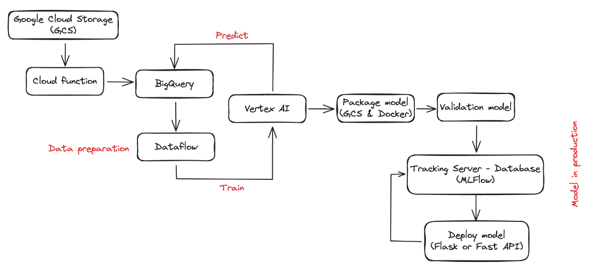
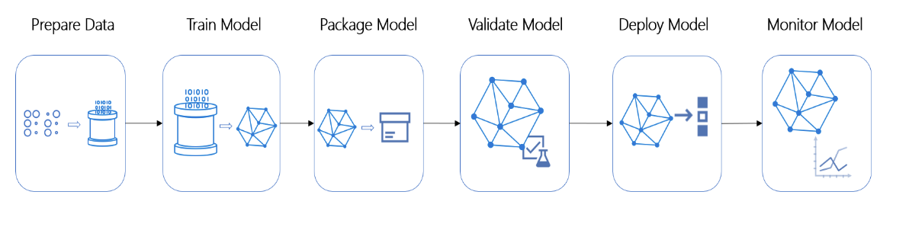
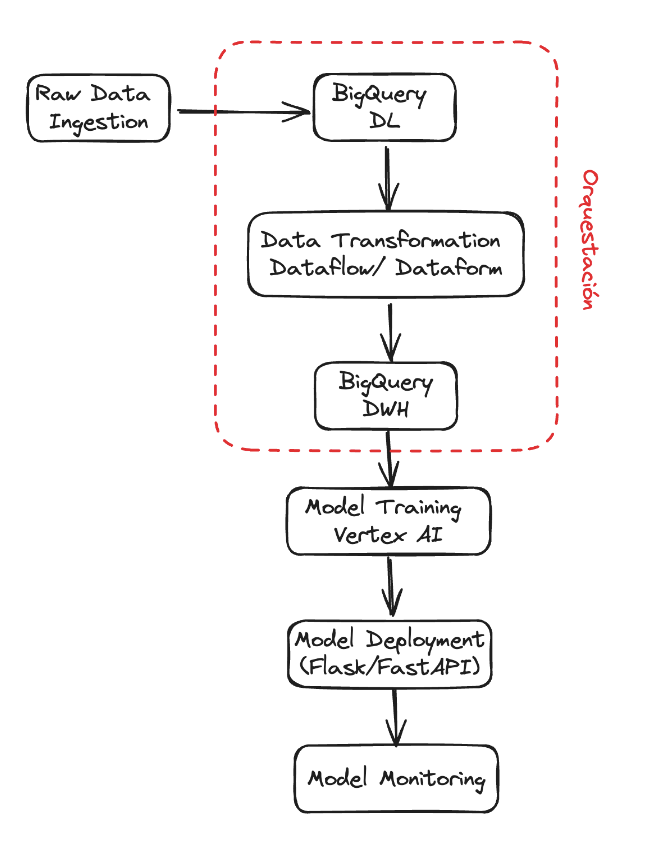
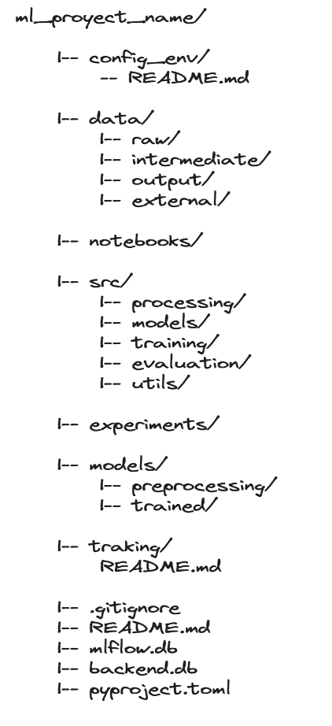

# 💜 **PRUEBA TÉCNICA PARA ML ENGINEER - NEQUI** 💜

1. ## **Propuesta de arquitectura en la nube.**

    La arquitectura a implementar se va realizar mediante las buenas prácticas de MLOps, ya que permite implementar y mantener los modelos de aprendizaje automático en producción de manera confiable y eficiente debido a que permite la escalabilidad del mismo. Para este caso se plantea la siguiente arquitectura como metodología de desarrollo. Esta se plantea con los respectivos servicios de GCP y librerías open source para el desarrollo, manteniendo la esencia de MLOps.

    

    Almacenamiento en Cloud Storage: Cloud Storage proporciona un almacenamiento altamente escalable y duradero para los datos sin procesar. Esto permite almacenar grandes volúmenes de datos de manera eficiente y confiable.

    - **Procesamiento escalable con Dataflow:** Dataflow permite realizar transformaciones y limpieza de datos de manera escalable y paralela en el Data Lake de BigQuery. Esto asegura que el procesamiento de grandes conjuntos de datos se pueda llevar a cabo de manera eficiente y rápida.

    - **Almacenamiento en BigQuery:** BigQuery ofrece un Data Warehouse altamente escalable y totalmente administrado para almacenar datos limpios y procesados. Esto permite realizar consultas analíticas complejas sobre grandes volúmenes de datos con alto rendimiento y confiabilidad.

    - **Entrenamiento de modelos con Vertex AI:** Vertex AI proporciona herramientas y servicios para entrenar modelos de Machine Learning a gran escala de manera eficiente. Esto facilita el entrenamiento de modelos con grandes conjuntos de datos y garantiza la escalabilidad del proceso de entrenamiento.

    - **Empaquetado y almacenamiento en GCS:** El empaquetado y almacenamiento del modelo entrenado en Google Cloud Storage asegura que el modelo esté disponible de manera confiable para su implementación y uso en producción.

    - **Validación del modelo:** Se realiza una validación exhaustiva del modelo entrenado para garantizar su calidad y precisión antes de su implementación en producción. Esto asegura que el modelo sea confiable y pueda manejar grandes volúmenes de datos de manera efectiva.

    - **Monitoreo con MLflow:** Se utiliza para monitorear el modelo tanto en etapas de validación como en producción. Esto proporciona visibilidad en tiempo real sobre el rendimiento del modelo y permite detectar y resolver problemas de manera proactiva.

    En la arquitectura propuesta, para la preparación de los datos se elige el servicio de Google Cloud Storage (GCS) como almacenamiento inicial de datos sin procesar debido a su escalabilidad, durabilidad y facilidad de acceso desde otros servicios de Google Cloud Platform (GCP). BigQuery se utiliza en la parte inicial de preparación debido a su capacidad para manejar grandes volúmenes de datos de manera eficiente y realizar consultas complejas en datos estructurados. Además, mediante una Cloud Function se facilita la transferencia de datos desde GCS a BigQuery, permitiendo una carga automática y programada a través de un trigger (un scheduler) que activa la función para generar la carga por batch.
    El proceso de workflow a partir de ETL (Extrac, Transform and Load) se realizará mediante Google Cloud Dataflow. Este servicio se selecciona debido a que en esta etapa se realizan transformaciones y limpieza, y Dataflow brinda la capacidad de procesar datos en tiempo real o por batch. Además, permite implementar pipelines de procesamiento de datos flexibles y escalables, lo que facilita la manipulación y transformación de grandes conjuntos de datos. También se considera la posibilidad de utilizar Dataform, un servicio directamente de BigQuery, para realizar las mismas tareas de flujo de trabajo.
    En cuanto a Vertex AI, se realizará el entrenamiento de modelos de Machine Learning debido a su conjunto de herramientas y servicios que simplifican y automatizan el proceso de entrenamiento de modelos a gran escala. Vertex AI proporciona un entorno integrado para el desarrollo, entrenamiento, evaluación y despliegue de modelos de ML, lo que facilita la implementación de modelos en producción.

2. ## **Step by step.**

    Se plantea el siguiente diagrama de secuencia y la arquitectura usando Google Cloud Platform (GCP) para las buenas prácticas de MLOps.

    

    Y a continuación el diagrama de secuencia de pasos desde la ingestión de datos hasta la monitorización y el entrenamiento continuo, incluyendo la orquestación:

    

    El componente de orquestación desempeña un papel fundamental en la ejecución del pipeline de Machine Learning (ML) al coordinar las diferentes tareas involucradas en el proceso. Automatiza la ejecución del pipeline, garantizando que las tareas se realicen en el orden correcto y que los resultados de una tarea estén disponibles para las siguientes. Además, facilita la escalabilidad del pipeline, distribuyendo las tareas de manera eficiente y aprovechando recursos adicionales según sea necesario. 

    La orquestación también gestiona las dependencias entre las tareas, asegurando que una tarea no comience hasta que todas sus dependencias estén completas y que las tareas se ejecuten en paralelo cuando sea posible. En resumen, el componente de orquestación asegura una ejecución eficiente y confiable del pipeline de ML, lo que contribuye a obtener resultados de alta calidad de manera consistente.

3. ## **Estructura de Directorios.**

    #### **Directorio para el proyecto de ML:**

    

    Para manejar la versión del pipeline de preprocesamiento y los modelos entrenados en el directorio de modelos, puedes seguir estas prácticas:

    **Control de versiones con Git:** Utiliza un sistema de control de versiones como Git para rastrear cambios en el código y los modelos. Cada vez que realices cambios en el pipeline de preprocesamiento o entrenes un nuevo modelo, haz un commit y etiqueta la versión correspondiente.

    **Directorio de modelos entrenados:** Mantén un directorio separado para almacenar modelos entrenados, organizados por versión y tipo de modelo. Por ejemplo, puedes tener subdirectorios para cada versión del modelo y dentro de ellos subdirectorios para cada tipo de modelo entrenado.

    **Metadata asociada a los modelos:** Incluye documentación y metadata asociada a cada modelo entrenado, como métricas de rendimiento, configuración utilizada, fecha de entrenamiento, etc. Esto proporciona contexto adicional sobre cada versión del modelo y facilita su gestión.

4. ## **Pipeline de entrenamiento continuo.**

    El pipeline de entrenamiento continuo es un proceso automatizado que ejecuta tareas de entrenamiento de modelos regularmente en respuesta a cambios en el código o nuevos datos disponibles. Este proceso implica la definición del flujo de trabajo, la automatización del proceso mediante herramientas de integración continua, la conexión del repositorio de código, la especificación de eventos que activan el pipeline, el preprocesamiento de datos, el entrenamiento del modelo, la evaluación del rendimiento del modelo, y finalmente, el despliegue o almacenamiento del modelo entrenado. Este enfoque permite una mejora continua del modelo en un entorno automatizado y controlado.

5. ## **Propuesta de Monitoreo**

    - Para monitorear eficazmente un **ML Pipeline**, es fundamental seleccionar métricas apropiadas que proporcionen una visión completa del rendimiento del modelo y del proceso en general. Algunas métricas propuestas y su importancia incluyen:

        **Precisión del modelo:** Mide la proporción de predicciones correctas sobre el total de predicciones realizadas. Es importante porque indica la exactitud del modelo en la clasificación de datos, lo que permite evaluar su capacidad para tomar decisiones precisas.
    
        **Recall:** Mide la proporción de instancias positivas que fueron correctamente identificadas por el modelo. Esta métrica es esencial para evaluar la capacidad del modelo para encontrar todos los casos positivos, lo que es crítico en aplicaciones donde la detección de casos positivos es prioritaria.
    
        **F1-score:** Es una medida que combina la precisión y el recall en una sola métrica. Es útil para tener una visión equilibrada del rendimiento del modelo, especialmente cuando hay un desequilibrio entre las clases de interés.
    
        **Tiempo de entrenamiento y de predicción:** Estas métricas son importantes para evaluar la eficiencia del pipeline. Un aumento en el tiempo de entrenamiento o predicción puede indicar problemas de escalabilidad o rendimiento que deben abordarse.

    - Para configurar alertas para cambios y problemas en la calidad de datos en el modelo implementado, se pueden considerar las siguientes estrategias:

        **Monitoreo de datos de entrada:** Establecer alertas para detectar cambios significativos en la distribución de los datos de entrada. Esto podría indicar problemas de calidad de datos, como la presencia de valores atípicos o la falta de datos relevantes.
    
        **Validación de datos en tiempo real:** Implementar controles de calidad de datos en tiempo real durante el proceso de predicción para detectar datos corruptos o inconsistentes. Esto podría incluir la detección de valores faltantes o fuera de rango, así como la comparación con valores esperados.

    - Para configurar alertas y acciones para una posible degradación del modelo, se pueden considerar las siguientes estrategias:

        **Seguimiento de métricas de rendimiento:** Establecer umbrales para las métricas de rendimiento del modelo y configurar alertas para detectar una disminución significativa en estas métricas. Esto podría indicar una degradación en el rendimiento del modelo que requiere atención.
    
        **Implementación de pruebas A/B:** Comparar el rendimiento del modelo actual con versiones anteriores utilizando pruebas A/B. Si se detecta una diferencia significativa en el rendimiento, se pueden activar alertas para investigar y abordar posibles problemas.
